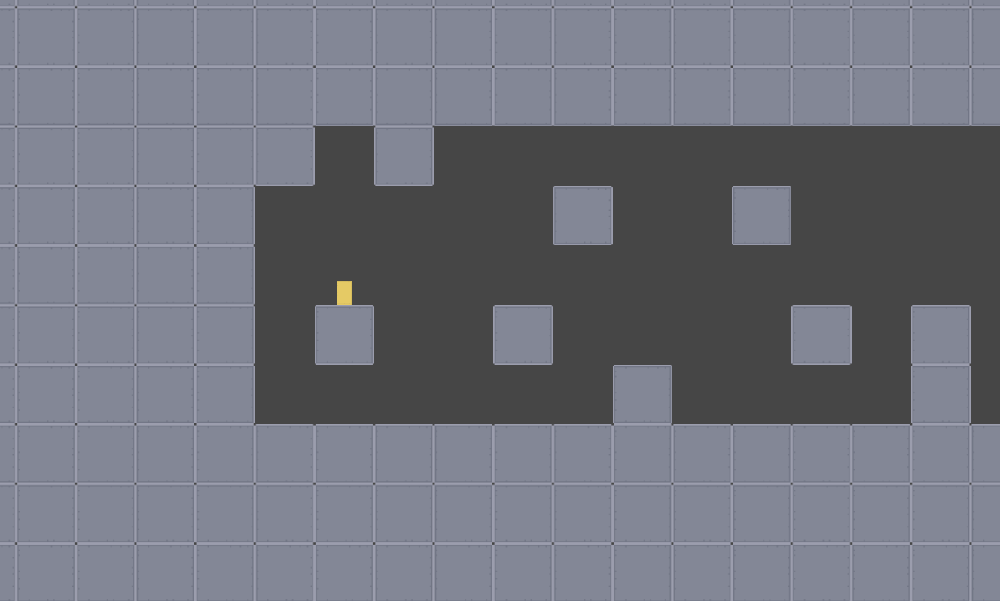
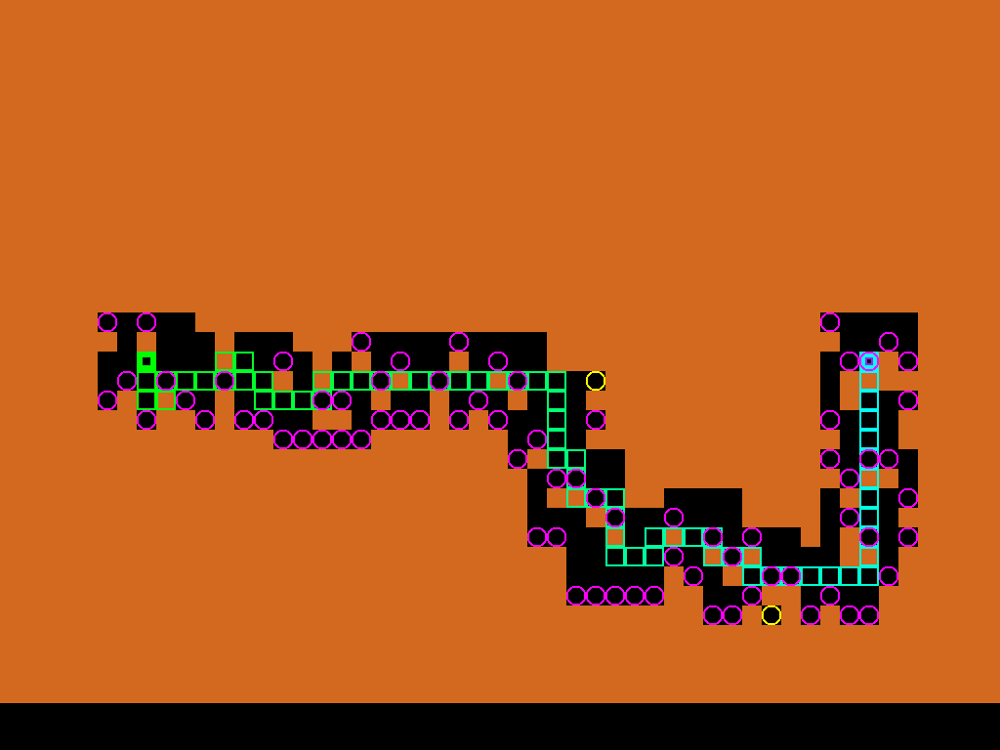
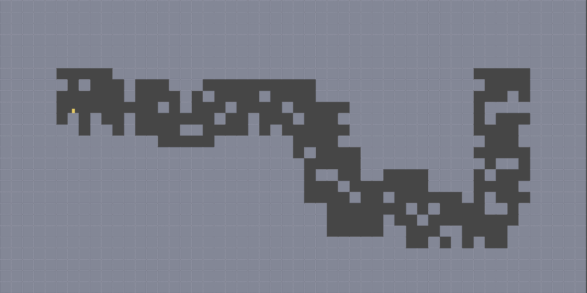

# ProcGenPlatformer
 
This repository contains the source code and assets for a grid based 2D platformer game.

## Overview
- This game was used to evaluate the procedural level generator built using a machine learning model (RL model) which resides in a different repository.
- This game includes functionality to deserialize and load the levels exported by the level generator.
- All levels generated by the generator were loaded and evaluated for human feedback and play testing.

Following image shows a snapshot of the game during game play.

Following images show the sample level generated by model in the reinforcement learning environment (1) and how the level looks in this game (2).

